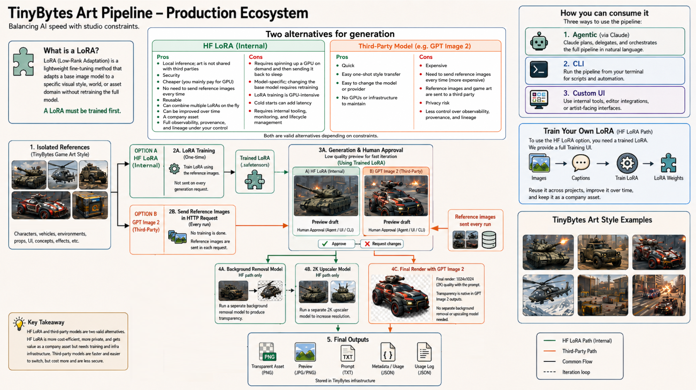

# Concept Art Generator



A production-minded TinyBytes assessment project: concept art organised by **art model** — a named visual style that owns its own reference images and its own trained private LoRA. Three exist (`drone-bc`, `pilot-bc`, `pilot-mw`) and their references never mix. Every asset passes a human approval gate: **low-resolution draft → explicit approval → transparent final**.

## Architecture

There are **three independent ways to drive the pipeline**, and they all sit on top of one shared
core. The agent path is optional: the UI and the CLI involve no Claude at all.

```text
  Agent (Claude Code)          UI (concept-art-ui)          CLI (concept-art)
  ├─ style-director            Gradio: References tab       subcommands printing
  ├─ technical-artist          (gallery + captions) and     JSON on stdout
  └─ verifier                  Generate tab (+ approval)
         │                             │                            │
         └──────────────┬──────────────┴────────────────────────────┘
                        ▼
                 ConceptArtWorkflow
    art-model isolation · trigger words · draft → approved → final
    transparency gate · provenance sidecars · usage ledger
                 │                          │
          GPT Image 2                HF Space + this model's LoRA
          reference edit             replayable JSON API
```

`ConceptArtWorkflow` is the only place a job is created, approved, or exported, so every rule below
holds identically no matter which of the three entry points you use.

- **Isolation:** each art model lives under `data/models/<art-model>/`; references are selected only from that folder and hashes are recorded in each job. There is no global reference pool.
- **Human oversight:** `final` refuses all non-approved jobs.
- **Bounded model choice:** exactly three art models exist. Choosing one chooses its LoRA, so a slug is never typed or guessed; anything else is refused at the CLI, the API and the workspace.
- **Transparency:** both providers are asked for transparent output and a verifier rejects opaque PNGs before export.
- **Cost hygiene:** each paid stage appends a record to `data/usage.jsonl`; secrets are environment variables and never committed.
- **Providers:** GPT Image 2 uses the image-edit endpoint with up to 16 of the art model's own references. Each reference has a stored description; GPT creates it through the Responses API when one is not supplied. If more than 16 references exist, GPT ranks their descriptions against the art request and the best 16 are attached. The HF backend calls the private Qwen Image LoRA Studio's `/v1/generate` endpoint and persists the returned replay parameters. GPT Image 2 supports image input/output through image endpoints, per [official OpenAI documentation](https://developers.openai.com/api/docs/models/gpt-image-2).

The final pass exports 2048×2048. The Hugging Face path repeats the approved 1024×1024 generation parameters and enables the Space's Swin2SR x2 upscaler; GPT Image 2 generates its high-quality 2K final directly.

## Setup

Requires Python 3.11+.

```bash
python -m venv .venv
.venv\Scripts\activate
pip install -e ".[dev]"
```

That is enough to run the tests and start the UI. To generate images you also need provider
credentials — set them as **system environment variables**, not in a file; see
[Secrets](#secrets-the-os-environment-not-env).

## Secrets: the OS environment and `.env`

The project reads four environment variables. None of them are required to browse the code, run the
tests, or start the UI — they are only needed by the backend you actually call.

| Variable | Needed for | Notes |
|---|---|---|
| `OPENAI_API_KEY` | GPT Image 2 generation, and GPT-written reference descriptions/ranking | Provider credential. Not needed if you caption references yourself and only use Hugging Face. |
| `OPENAI_REFERENCE_MODEL` | Reference descriptions and 16-of-N selection | Not a secret. Optional; defaults to `gpt-5.6-luna`. |
| `HF_SPACE_URL` | Hugging Face generation | Not a secret. Example: `https://<owner>-qwen-image-lora-studio.hf.space` |
| `HF_TOKEN` | Private Space and private LoRA access | Token with read access. |

### Where they live

**The application reads ordinary environment variables.** `.env` is an optional local convenience,
not a requirement — nothing needs it, and nothing fails without it. Recommended practice is to keep
the two real secrets, `OPENAI_API_KEY` and `HF_TOKEN`, **in the system environment only**, and leave
them out of `.env` entirely.

`src/concept_art_generator/config.py` loads `.env` with `override=False`, so the resolution order is:

1. A variable already in the process environment — **always wins**.
2. Otherwise, a value from `.env` in the current working directory, if that file exists.
3. Otherwise, unset.

Because step 2 reads the **current working directory**, a `.env` in this repository is silently
ignored when you run `concept-art` from anywhere else. System environment variables work from any
directory, which is the second reason to prefer them.

#### Setting them at OS level

Windows, persistent for your user account (reopen the terminal afterwards):

```powershell
[Environment]::SetEnvironmentVariable('OPENAI_API_KEY', '<key>', 'User')
[Environment]::SetEnvironmentVariable('HF_TOKEN', '<token>', 'User')
```

Windows, current session only:

```powershell
$env:OPENAI_API_KEY = '<key>'
$env:HF_TOKEN = '<token>'
```

macOS / Linux, current session (add to `~/.zshrc` or `~/.bashrc` to persist):

```bash
export OPENAI_API_KEY='<key>'
export HF_TOKEN='<token>'
```

Confirm they are visible without revealing them:

```powershell
[bool]$env:OPENAI_API_KEY, [bool]$env:HF_TOKEN
```

#### Why this is the safer default

A `.env` is a plaintext file inside the project folder, which means it is exposed to a much wider
set of readers than a process environment variable:

- Any agent, editor extension, indexer, linter, or script with filesystem access to the repository
  can read it — including tools you did not think of as "having your keys".
- It can be committed by accident (a `git add -f`, a misconfigured `.gitignore`, a copy of the repo
  into a directory whose ignore rules differ), and it travels with the folder when the project is
  zipped, backed up, or shared.
- It shows up in screen shares, file-tree screenshots, and diffs.

Environment variables are not a vault — any process running as your user can still read them — so
the gain is specific rather than absolute: the secret is not sitting on disk in the project, and it
cannot leak by copying or committing the folder. That is exactly the risk the comment at the top of
`.env.example` is warning about.

If you do use `.env`, keep it to the **non-secret** settings, and let the OS supply the credentials:

```bash
# .env — safe to keep here
OPENAI_REFERENCE_MODEL=gpt-5.6-luna
HF_SPACE_URL=https://<owner>-qwen-image-lora-studio.hf.space
# OPENAI_API_KEY and HF_TOKEN: set these in the system environment instead.
```

`.env` is gitignored; `.env.example` is committed and contains no values.

### How they are handled

Keys are used as provider authentication only — `Authorization: Bearer <HF_TOKEN>` for the Space,
and the OpenAI SDK's own credential handling for `OPENAI_API_KEY`. They are never added to prompts,
job JSON, `.png.prompt` sidecars, `data/usage.jsonl`, output metadata, UI responses, or logs.

### Rules

- Never place API keys in prompts, source files, job JSON, logs, screenshots, or commits.
- Never `cat .env` or echo a key in an agent session; the orchestrator instructions in `CLAUDE.md`
  forbid it explicitly.
- Treat any agent or program with shell access as trusted code: use dedicated least-privilege
  provider keys, set a spend cap on the OpenAI key, and scope the HF token to only the private
  Space and LoRA repositories it needs.
- Rotate a key immediately if it is exposed.
- Keep invoices in the provider accounts; `data/usage.jsonl` is the local usage log.

## The three art models

An **art model** is the unit of work: a named visual style that owns its reference images and its
trained private LoRA. Exactly three exist, listed in `src/concept_art_generator/art_models.py`,
which is the single place to edit when one is trained, added, or retired. Everything else is
refused — the CLI restricts the argument, the API returns 404, and the workspace will not open a
folder for it.

| Art model | Trigger | LoRA it uses | Subject | Style keywords |
|---|---|---|---|---|
| `drone-bc` | `drone-bc` | `jjmcarrascosa/drone-bc` | A drone | stylized 3D rendered game asset, glossy cel-shaded surfaces |
| `pilot-bc` | `pilot-bc` | `jjmcarrascosa/pilot-bc` | A pilot | flat vector game art |
| `pilot-mw` | `pilot-mw` | `jjmcarrascosa/pilot-mw` | A pilot | semi-realistic painted digital game art, soft rim lighting |

The art model name is also the LoRA's trigger word, so you never type a slug: picking `drone-bc`
picks `jjmcarrascosa/drone-bc`. GPT Image 2 takes no LoRA at all — it uses the same art model's own
reference images instead.

Run `concept-art models` for the catalogue as JSON, including each example prompt in full. See
[Prompt building](#prompt-building) for the shape a LoRA prompt must take.

## Prompt building

The two backends need genuinely different prompts, so `src/concept_art_generator/prompts.py` has a
single `build_prompt(request, descriptions, backend)` that dispatches on the backend. It is the only
place a generation prompt is constructed.

Both shapes start with the art model's trigger word — `drone-bc A drone ...` — so a prompt reads the
same whichever backend it went to. It is prepended for you and never doubled up if you type it
yourself. What the trigger *means* differs: for Hugging Face it is the trained token the LoRA fires
on; for GPT Image 2 it is only a label, and the style still comes from the references.

### Hugging Face + LoRA — the trained caption shape

Each LoRA was trained on captions of one exact shape, so the prompt is restricted to that shape and
nothing else is added:

```text
<trigger> <subject keyword> <details>, <that LoRA's style keywords>, plain white background
```

The trigger is the LoRA name without the owner prefix, and it is prepended for you — do not type it.
That LoRA's style keywords are appended when you leave them out. No scene description, no framing
boilerplate, and deliberately **no "transparent background" instruction**: the trained captions say
`plain white background`, and the Space strips it server-side via `remove_background`, so asking the
LoRA for something its captions never said would only push it off-distribution.

```text
you type:  A drone with a squat black hull and cyan thrusters
sent:      drone-bc A drone with a squat black hull and cyan thrusters,
           stylized 3D rendered game asset, glossy cel-shaded surfaces, plain white background
```

Write the subject the same way that LoRA's own example does. **These examples apply to the Hugging
Face LoRA backend only** — they are the captions the adapters were trained on, and they mean nothing
to GPT Image 2.

`jjmcarrascosa/drone-bc`

> drone-bc A drone with a smooth white and grey egg-shaped shell, lime green thruster rings on each side, a
> glowing orange vent slot on its face, two upright yellow-tipped blade fins above and one below,
> stylized 3D rendered game asset, glossy cel-shaded surfaces, plain white background

`jjmcarrascosa/pilot-bc`

> pilot-bc A pilot in a horned imp mask and hood, wearing a green graffiti-covered hooded jacket and dark
> cargo trousers, holding a curved black blade, in colourful high-top sneakers, full body, flat
> vector game art, plain white background

`jjmcarrascosa/pilot-mw`

> pilot-mw A pilot undead soldier with a blazing skull head wreathed in orange fire, heavy charcoal combat
> armour lined with glowing orange lights, a rifle held at his hip, semi-realistic painted digital
> game art, soft rim lighting, plain white background

### GPT Image 2 — our own style-director prompt from the references

There is no LoRA here, so **none of the caption shape above applies** beyond the leading trigger
word, which rides along as a label. GPT Image 2 gets our own style-director prompt instead: the art
model's reference images are attached to the edit request, and the style descriptions extracted from
those references are restated in the prompt as notes, so the requirement is explicit rather than
implied. Write a plain subject line and let the references carry the style.

```text
Concept art. Subject: drone-bc An armored street racer. Match only the visual language
of the attached reference images: silhouette discipline, materials, palette,
lighting and rendering style. Style extracted from those references:
- White egg-shaped drone shell with lime thruster rings
- Orange armoured hull panel, glossy cel-shaded
Single isolated subject, centered, no scenery, no text, no watermark, transparent background.
```

### Fallback and replay

When a Hugging Face request falls back to GPT Image 2, the prompt is **rebuilt** in the GPT shape
above — the trained style keywords mean nothing to it, and it needs the reference-derived style
instead. The trigger prefix survives the rebuild. An HF final replays the approved draft's prompt
byte for byte.

## References and captions

Every reference lives under `data/models/<art-model>/references/`, and each one carries a text
description stored in `descriptions.json`. Descriptions are not decoration: when a model has more
than 16 references, GPT ranks these descriptions against the art request and picks the 16 to
attach, so specific captions produce better drafts.

Captions follow the **Qwen Image LoRA Studio dataset convention** — `drone.txt` captions
`drone.png`, matched by filename — used here to set reference descriptions rather than training
captions. **Every caption belongs to one image**; there is deliberately no shared or blanket
description, because identical text across many references would make the 16-of-N ranking above
arbitrary and would say nothing in the job's provenance record.

**Adding images and captioning them are separate steps.** Adding a reference only stores the file;
it never contacts a provider, so uploading a folder is instant and no caption is invented for an
image you have not looked at. Captions arrive afterwards, in whichever way suits you:

1. **A `.txt` file** — a sibling next to the image on the CLI, or uploaded through *Add caption .txt
   files* in the UI, matched by filename stem.
2. **By hand** — the UI's **References** tab shows every image in a gallery with an editable
   description box under each thumbnail; *Save captions on this page* persists them.
3. **GPT, on request** — press *Describe blank ones with GPT* in the UI (needs `OPENAI_API_KEY`).
   It only touches references that are still empty, so hand-written and `.txt` captions are never
   overwritten, and it shows a progress bar because each image is a separate API call.

The CLI's `add-reference` is the exception, and deliberately so: it handles one image at a time, so
`concept-art add-reference drone-bc drone.png "Egg-shaped white drone shell"` takes the caption
inline, and omitting it falls back to a sibling `drone.txt` and then to GPT.

Adding a reference the art model already holds is idempotent: the image is not duplicated, and its
caption is left alone unless you supply a new one — so re-adding a folder never overwrites what you
wrote by hand, and never spends a GPT call on a reference that already has a description. A
different image arriving under a name the model already uses is kept alongside it, not silently
replaced.

## Running a generation

The pipeline is the same in all three places, and both backends are available in all three:

| | Agent | UI (Gradio) | Command line |
|---|---|---|---|
| Add references | `concept-art add-reference` | **References** tab | `concept-art add-reference` |
| Caption references | `.txt` sibling or argument | caption boxes, `.txt` upload, or *Describe blank ones with GPT* | `.txt` sibling or argument |
| GPT Image 2 draft | `--backend gpt-image-2` | **Generate** tab, backend radio | `--backend gpt-image-2` |
| Hugging Face draft | `--backend huggingface` | **Generate** tab, backend radio | `--backend huggingface` |
| Approve / reject | `concept-art approve` / `reject` | **Approve draft** / **Request changes** | `concept-art approve` / `reject` |
| 2K final | `concept-art final` | **Export 2K final** (locked until approved) | `concept-art final` |

### 1. From an agent

`CLAUDE.md` and `.claude/agents/` make Claude Code the orchestrator. Open the repository in Claude
Code and ask in natural language:

```text
Generate concept art with the drone-bc model:
a drone with a squat black and orange armoured hull, twin stubby side thrusters glowing cyan.
```

```text
Generate concept art with the pilot-mw model using GPT Image 2:
an undead artillery gunner in heavy charcoal armour.
```

The orchestrator then:

1. Confirms which single art model is in scope. It never reads, attaches, summarizes, or transmits
   another model's references.
2. Asks which of the three models to use if you have not said. It never invents a fourth, and it
   never types a LoRA slug — the model determines it.
3. Delegates planning to `style-director` (read-only, scoped to that model).
4. Has `technical-artist` produce one 1024×1024 draft, then stops.
5. Waits for your explicit approval — `concept-art approve <art-model> <job-id>` — or a rejection with
   feedback.
6. Delegates the final export, then invokes `verifier` last.
7. Routes any failure back to `technical-artist`, never to `verifier`.

Agents drive the same CLI documented below; every command prints JSON, so
`concept-art jobs <art-model>` and `concept-art show <art-model> <job-id>` are the read-back points. See `CLAUDE.md` for the full rule
set the orchestrator follows.

### 2. From the UI

```bash
concept-art-ui
# http://127.0.0.1:8000
```

Ctrl+C stops it straight away, even with tabs still open: each open tab holds a Gradio heartbeat
stream that uvicorn would otherwise wait on forever, so `main()` closes those streams as it exits
and caps the graceful shutdown at `SHUTDOWN_GRACE_SECONDS`.

The front end is a Gradio app adapted from the Qwen Image LoRA Studio, so it looks and behaves like
the tool the LoRAs were trained in. Three tabs:

- **References** is the studio's Train gallery, repurposed. Pick the art model, then *Add reference
  images* — which stores them immediately and contacts nothing. Every reference appears as a
  thumbnail with its own caption box underneath, paged eight at a time. Caption them with *Add
  caption .txt files*, by typing and pressing *Save captions on this page*, or with *Describe blank
  ones with GPT*, which fills only the empty ones and shows a progress bar while it runs. The status
  line tells you how many are still uncaptioned.
- **Generate** is the studio's Generate panel plus the approval gate, cut down to the three
  choices that actually vary: the art model — which picks its LoRA — the prompt, and the backend.
  The prompt box preloads that model's own example so you edit rather than start blank (anything
  you type yourself is never overwritten). Everything else is fixed at the `ArtRequest` defaults —
  transparent output, up to 16 references, and the sampler settings the LoRAs were trained for —
  so there is no accordion of knobs to get wrong. **Create 1024px draft** renders over a
  checkerboard so transparency is visible, and prints the exact prompt sent to the provider.
  **Approve draft** / **Request changes** are enabled only for a `draft_ready` job, and
  **Export 2K final** stays disabled until that draft is approved. Picking `huggingface` still
  falls back to GPT Image 2 on its own if the Space is asleep or errors; the job's notes record it.
- **Jobs** lists every job for the selected art model with its state, backend and prompt.

The JSON API is mounted on the same server, so scripts and agents can drive it too:

```bash
curl http://127.0.0.1:8000/api/models
curl -X POST http://127.0.0.1:8000/api/models/drone-bc/jobs/<job-id>/approve
curl -X POST http://127.0.0.1:8000/api/models/drone-bc/jobs/<job-id>/final
curl -X POST "http://127.0.0.1:8000/api/models/drone-bc/jobs/<job-id>/reject?feedback=Wider%20silhouette"
```

Generated files are served at `/assets/<art-model>/drafts/<job-id>` and
`/assets/<art-model>/finals/<job-id>`.

### 3. From the command line

```bash
# A description argument, or a sibling drone.txt, or GPT writes one.
concept-art add-reference drone-bc path	o\drone.png "Egg-shaped white drone shell, lime thruster rings"
concept-art add-reference pilot-bc path	o\pilot.png

# Hugging Face: the art model determines the LoRA, so no slug is ever typed.
concept-art draft drone-bc "A drone with a smooth white and grey egg-shaped shell, lime green thruster rings on each side, a glowing orange vent slot on its face, two upright yellow-tipped blade fins above and one below, stylized 3D rendered game asset, glossy cel-shaded surfaces, plain white background" --backend huggingface

concept-art draft pilot-bc "A pilot in a horned imp mask and hood, wearing a green graffiti-covered hooded jacket and dark cargo trousers, holding a curved black blade, in colourful high-top sneakers, full body, flat vector game art, plain white background" --backend huggingface --seed 42 --steps 28 --guidance-scale 4.0 --lora-scale 1.25

concept-art draft pilot-mw "A pilot undead soldier with a blazing skull head wreathed in orange fire, heavy charcoal combat armour lined with glowing orange lights, a rifle held at his hip, semi-realistic painted digital game art, soft rim lighting, plain white background" --backend huggingface

# GPT Image 2 needs no LoRA; it uses this art model's references.
concept-art draft drone-bc "A drone with a smooth white and grey egg-shaped shell, lime green thruster rings on each side, stylized 3D rendered game asset, glossy cel-shaded surfaces, plain white background" --backend gpt-image-2

concept-art approve drone-bc <job-id>
concept-art final drone-bc <job-id>

# Keep artist feedback with a rejected draft; no final can be made from it.
concept-art reject drone-bc <job-id> --feedback "Wider silhouette; reduce surface noise"

# Read-back
concept-art models
concept-art jobs drone-bc --state draft_ready
concept-art show drone-bc <job-id>
```

Every command prints the job (or list) as JSON on stdout. `concept-art --help` reprints the runnable
example above for each art model. `--data-dir` relocates the workspace root, which defaults to `data`.
`--references N` caps how many references a draft may use (1–16), and `--opaque` disables the
transparent-PNG default.

Drafts use all of the art model's references up to 16. When there are more, GPT receives only their stored text descriptions and chooses the 16 best matches; the exact filenames, descriptions, and hashes are persisted so the final reuses the same set.

## Choosing a generation backend

| Backend | Use it when | Pros | Trade-offs |
|---|---|---|---|
| **GPT Image 2** | The art model has references and you need visual adherence without training first. | Sends up to 16 selected references belonging to that art model to the edit endpoint; GPT description matching narrows larger pools; fast to start; requests transparent output. | Paid per generation; references leave the local machine for the provider; needs `OPENAI_API_KEY`; style consistency depends on reference selection and prompt quality. |
| **Hugging Face Space + the model's LoRA** | The art model's style is already trained into one of the three private Qwen Image LoRAs. | Does not transmit the reference images for inference; reusable style adapter; the model-to-LoRA binding makes style selection explicit and auditable; supports Swin2SR 2K finals and server-side background removal. | Requires an available GPU Space and private-token access; first inference or upscaling can be slow; segmentation can trim delicate details, so quality must be reviewed. |

Both routes create a 1024×1024 draft first and require explicit approval before a final. GPT Image 2 uses `quality="low"`. HF/LoRA uses the configured prompt, negative prompt, LoRA, steps, guidance, LoRA scale, seed, scheduler, and base model; those exact values are persisted for the approved final. Both routes reject opaque PNGs rather than silently exporting non-transparent assets.

### Reliability and 2K final policy

When Hugging Face is selected, it is always tried first. A timeout, forbidden response, malformed response, or other provider error automatically retries through GPT Image 2 using only that art model's own references; the job audit notes record the fallback. If GPT Image 2 is unavailable or the model has no references, the job fails safely instead of borrowing another model's style.

References are required for GPT Image 2 and optional for Hugging Face — the LoRA carries the style, and only `GPTImage2Provider` reads them. Adding them to a Hugging Face model is still worth it: they are what the fallback has to work with if the Space is asleep.

Final exports are **2048×2048** and preserve their PNG alpha channel. For an HF final, the Space repeats the same deterministic 1024×1024 generation and applies tiled Swin2SR x2. The only stage-specific HF inference switch is `upscale_to_2k`: `false` for the draft and `true` after approval. `remove_background` remains identical between stages and follows the optional Transparent PNG selection. GPT Image 2 uses the approved draft as its primary edit input plus up to 15 selected style references, then generates the high-quality 2K final.

The equivalent Space request options are:

```json
{
  "width": 1024,
  "height": 1024,
  "guidance_scale": 4.0,
  "lora_scale": 1.25,
  "remove_background": true,
  "background_model": "birefnet-general",
  "upscale_to_2k": true
}
```

`remove_background` controls PNG transparency independently from 2K upscaling, so either option can be enabled without the other. `background_model` names the Space's segmentation model and is always sent explicitly, so a change of server-side default cannot silently alter an art model's cutouts; it defaults to `birefnet-general` and the Space rejects an unknown name with a 400. Guidance defaults to `4.0` and LoRA scale to `1.25`, matching the studio's own defaults.

### Hugging Face replay API protocol

The client sends every inference control to `POST <HF_SPACE_URL>/v1/generate`, including the bearer `HF_TOKEN`. The response contains the PNG and a canonical `generation_parameters` record with the actual seed and scheduler. That record is stored in the job and replayed for the final; generation fails closed if the active scheduler, LoRA scale, guidance, or background removal model no longer matches. The final request changes only `upscale_to_2k` from `false` to `true`.

## Provenance sidecars and feedback

Every generated PNG receives a sibling sidecar using the studio-friendly convention `image.png.prompt`. It contains the effective model/backend, complete generation prompt, LoRA name where applicable, the art model's reference hashes, request ID, dimensions, transparency selection, job state, and every approval/rejection comment.

The canonical job record remains in `data/models/<art-model>/jobs/<job-id>.json`; sidecars are refreshed when a draft is approved or rejected, so moving a generated asset does not lose its prompt or artist feedback.

## Project files

### Repository

| Path | What it is |
|---|---|
| `README.md` | This document. |
| `CLAUDE.md` | Orchestrator instructions Claude Code follows: isolation rules, the three LoRAs, the approval loop, allowed commands, and the secret-handling ban. Used only by the agent entry point. |
| `pyproject.toml` | Package metadata, dependencies, the `concept-art` / `concept-art-ui` entry points, and the pytest and ruff configuration. |
| `.env.example` | Committed template for the four environment variables, with the two credentials commented out. Contains no values. |
| `.gitignore` | Excludes `.env`, `data/`, caches, and build output. |
| `docs/art-pipeline.png` | The pipeline diagram at the top of this README. |

### Source — `src/concept_art_generator/`

| Module | Responsibility |
|---|---|
| `__init__.py` | Loads an optional `.env` on import, then exposes `ConceptArtWorkflow`. |
| `config.py` | `load_settings()`: optionally reads a `.env` from the working directory with `override=False`, so system environment variables always win. |
| `models.py` | Dataclasses and enums: `ArtRequest`, `ArtJob`, `Backend`, `JobState`, `DEFAULT_BACKGROUND_MODEL`, plus job JSON load/save. Not the art-model catalogue — that is `art_models.py`. |
| `art_models.py` | The closed catalogue of the three art models — trigger word, LoRA slug, subject keyword, style keywords, example prompt — and `resolve_model()`, which refuses anything else. |
| `prompts.py` | `build_prompt()` — the one place a prompt is built, dispatching on backend: the trained LoRA caption shape for Hugging Face, reference-extracted style for GPT Image 2. Both are prefixed with the art model's trigger word. |
| `workspace.py` | `ModelWorkspace` — the isolation boundary. Refuses an uncatalogued art model, owns every path under `data/models/<art-model>/`, stores reference descriptions, and computes reference hashes. |
| `references.py` | `OpenAIReferenceAgent` (GPT-written descriptions and text-only 16-of-N ranking) and the `.txt` caption helpers that implement the studio's `drone.txt → drone.png` convention. |
| `agents.py` | `QualityGate` — rejects an opaque PNG before export. |
| `providers.py` | `RenderSpec` / `RenderedImage`, `HuggingFaceSpaceProvider` (`POST /v1/generate`), `GPTImage2Provider` (images-edit endpoint), and `DeterministicProvider` for offline tests. |
| `workflow.py` | `ConceptArtWorkflow` — the shared core behind all three entry points: reference and caption handling, LoRA validation, draft, approve/reject, final with parameter replay, HF→GPT fallback, sidecars, and the usage ledger. |
| `cli.py` | The `concept-art` command: `add-reference`, `draft`, `approve`, `reject`, `final`, `show`, `models`, `jobs`. Every art-model argument is restricted to the three. |
| `web.py` | The JSON HTTP API under `/api/`, plus `/assets/` image serving. No markup: the human front end is Gradio, which `main()` mounts onto this same app. |
| `ui.py` | The Gradio front end adapted from the Qwen Image LoRA Studio: the References gallery with per-image captions and on-request GPT captioning, the Generate panel, and `approval_gate()`, which keeps the 2K final locked until a human approves. |

### Agent definitions — `.claude/agents/`

| File | Role |
|---|---|
| `style-director.md` | Read-only art-direction planner, scoped to exactly one art model. |
| `technical-artist.md` | Runs the CLI workflow for one art model; carries the three models and the prompt-style exemplars, and stops after the draft for human approval. |
| `verifier.md` | Read-only final check: job state, reference-hash isolation, alpha channel, usage ledger. |

### Tests — `tests/`

| File | Covers |
|---|---|
| `test_workflow.py` | Approval gate, rejection feedback, art-model isolation, opaque rejection, 16-of-N reference selection, HF parameter replay, GPT final input composition, HF→GPT fallback. |
| `test_providers.py` | HF request mapping and replay-parameter validation; GPT Image 2 reference limit and supported draft size. |
| `test_art_models.py` | The catalogue is exactly three; `drone-mw` and any other invented name are refused at the resolver, the workspace and `create_draft`; each model's LoRA and reference folder are its own. |
| `test_prompts.py` | Both prompt shapes: trigger prepended once, style keywords appended when missing, no wrapper text on the LoRA prompt, reference style notes in the GPT prompt, identical draft/final HF prompt, and a rebuilt prompt on the GPT fallback. |
| `test_captions.py` | Sibling `.txt` captions, caption priority, stem matching, the API upload/caption routes, that uploaded `.txt` captions are never overridden, and that re-adding a reference keeps its caption and spends no GPT call. |
| `test_web.py` | The JSON API end to end for both backends: draft → approve → final, the blocked final before approval, per-model job listing, and that markup stays out of `web.py`. |
| `test_ui.py` | The Gradio app builds, adding references contacts no provider, captioning touches only blank entries, and `approval_gate()` keeps the 2K final locked for every state except `approved`. |

### Generated at runtime — `data/` (gitignored)

```text
data/
├─ usage.jsonl                       # append-only local cost ledger
└─ models/<art-model>/               # drone-bc, pilot-bc or pilot-mw
   ├─ references/                    # this art model's reference images only
   │  └─ descriptions.json           # filename → stored description
   ├─ jobs/<job-id>.json             # canonical job record
   ├─ drafts/<job-id>.png            # 1024×1024 draft (+ .png.prompt sidecar)
   └─ finals/<job-id>.png            # 2048×2048 final (+ .png.prompt sidecar)
```

## Test

```bash
pytest -q
ruff check src tests
```